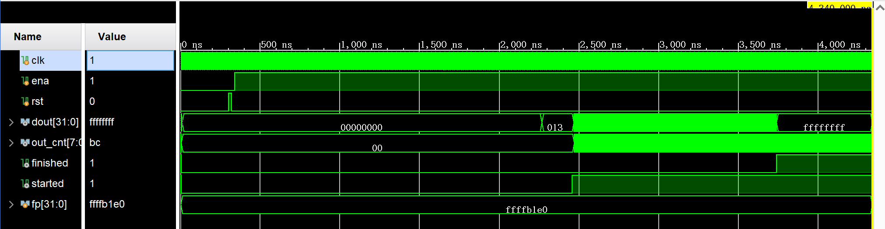

# 夏季学期综合实验报告

无82 李翔宇 2018011068

## 选题及设计方案

#### 实验内容

> （2）使用数字逻辑电路对128个32bit的无符号随机数进行排序，注意优化性能，并考虑消耗资源和性能之间的平衡。

#### 题目分析

不同于任务一要求的使用流水线结构的MIPS处理器进行排序，本任务要求使用数字逻辑电路直接排序，也就是要设计针对128个32bit数的专用排序电路。相比于通用性更强的CPU，专用的排序电路在性能和资源占用上可以得到更好的优化。并且相比于在CPU上串行执行汇编指令，我们在硬件上直接排序可以获得更好的并行度。

#### 设计思路

选定题目后，我首先做了一定的文献调研。我了解到对于较小的数据量，使用各类[sorting network](https://en.wikipedia.org/wiki/Sorting_network)可以迅速得到排序结果。Sorting network是一种组合逻辑电路（当然也可以做流水线设计，本次实验就是这么做的），通过comparator单元完成switch操作，从而整个网络能够实现排序功能。如图是一个简单的4输入sorting network：


Sorting network电路结构非常直观，而且排序非常快。但它的缺陷也很明显，就是空间复杂度比较高。本次实验中用到的[Batcher's odd–even mergesort network](https://en.wikipedia.org/wiki/Batcher_odd%E2%80%93even_mergesort)的网络大小大约是$O(n(log(n))^2)$的，其中n为输入数据的个数。当n=4时需要comparator个数为5；当n=16时需要comparator个数为63；而当n=64时需要comparator个数为543（[https://www.inf.hs-flensburg.de/lang/algorithmen/sortieren/networks/oemen.htm](https://www.inf.hs-flensburg.de/lang/algorithmen/sortieren/networks/oemen.htm)）。为了避免占用过多资源，直接设计一个n=128的sorting network是不可行的。

说到并行排序，我们很容易想到归并排序算法。我们可以将数据切分成若干组较少的数据，将每组分别通过sorting network排序后，再把各组排序结果进行归并，从而得到完整的排序结果。归并电路的设计和实现我参考了[FACE: Fast and Customizable Sorting Accelerator for Heterogeneous Many-core Systems](./refs/Kobayashi, Kise - 2015 - FACE Fast and Customizable Sorting Accelerator for Heterogeneous Many-core Systems.pdf)这篇paper，即通过以comparator为结点、FIFO为边的二叉树结构（文中称为merge sorter tree）完成序列的归并。Paper中给出的排序电路的架构如图：


需要注意的是，这篇paper给出的设计可通过多个phase来完成M级数据的排序，而我们仅需要排128个32bit数即可，因此可以简化数据通路。排序电路整体设计如下：


待排序数据分为8组，依次进入sorting network进行排序；之后通过一个多路选择器暂存到对应的input module里；当某路的input buffer不满时，对应的input module就会将数据依次补充进去；input buffer会记录本模块路已经输出的数据个数，当累计输出16个数据后就会持续输出`0xffffffff`补入归并网络以保证归并排序结果正确。具体的端口设计及模块实现请参考源代码。

## 文件清单

srcs/constrs/constrs.xdc为约束文件。

srcs/sims该目录下为testbench文件，其中sorter_tb.v为最终仿真时顶层文件，其余为debug之用。

srcs/sources目录下为设计代码。文件名与模块名相同，模块功能请参考前面的设计思路。Sorter.v为顶层文件。

其余为撰写报告用到文件。

## 关键代码

`Sorter`模块中整个电路的控制代码如下：

```verilog
    always @(posedge clk or posedge rst) begin
        if (rst) begin
            s_ena <= 0;
            im_ena <= 0;
            s_din <= 0;
            t_deq <= 0;
            cnt <= 0;
        end else if (ena) begin
            cnt <= cnt + 1;
            case (cnt)
                11'd10: begin
                    s_din <= din1;
                    s_ena <= 1;
                    im_ena <= 8'b00000001;
                end 
                11'd20: begin
                    s_din <= din2;
                end 
                11'd35: begin
                    im_ena <= 8'b00000010;
                end
                11'd45: begin
                    s_din <= din3;
                end 
                11'd60: begin
                    im_ena <= 8'b00000100;
                end
                11'd70: begin
                    s_din <= din4;
                end 
                11'd85: begin
                    im_ena <= 8'b00001000;
                end
                11'd95: begin
                    s_din <= din5;
                end 
                11'd110: begin
                    im_ena <= 8'b00010000;
                end
                11'd120: begin
                    s_din <= din6;
                end 
                11'd135: begin
                    im_ena <= 8'b00100000;
                end
                11'd145: begin
                    s_din <= din7;
                end 
                11'd160: begin
                    im_ena <= 8'b01000000;
                end
                11'd175: begin
                    s_din <= din8;
                end 
                11'd185: begin
                    im_ena <= 8'b10000000;
                end
                11'd210: begin
                    im_ena <= 8'b00000000;
                    t_deq <= 1;
                    started <= 1;
                end
            endcase
        end
    end
```

整体上分为两个阶段：第一阶段各路数据依次排序；第二阶段将排好序的各路数据进行归并。归并的过程中持续输出排序结果。

`MergeComparator`设计如下：

```verilog
module MergeComparator(
    input wire [31:0] din_1,    
    input wire [31:0] din_2,
    input wire valid_1,
    input wire valid_2,
    input wire full,            // output fifo is full
    output wire [31:0] dout,
    output wire enq,            // enqueue output fifo
    output wire deq_1,          // dequeue input 1
    output wire deq_2           // dequeue input 2
    );
    wire cmp = (din_1 < din_2);

    assign dout = cmp ? din_1 : din_2;
    assign enq = (!full && valid_1 && valid_2);
    assign deq_1 = cmp && enq;
    assign deq_2 = !cmp && enq;
    
endmodule
```

通过此模块完成基本的两路数据的归并。

`FIFO2`中时序逻辑设计如下：

```verilog
// register file does not support asynchronous reset
    always @(posedge clk) begin
        if(rst) begin
            cnt <= 2'd0;
            head <= 0;
            tail <= 0;
            out_cnt <= 0;
        end else begin
            case ({enq, deq})
                2'b01: begin
                    head <= ~head;
                    cnt <= cnt - 1;
                    out_cnt = ~out_cnt;
                end
                2'b10: begin
                    mem[tail] <= din;
                    tail <= ~tail;
                    cnt <= cnt + 1;
                end
                2'b11: begin
                    mem[tail] <= din;
                    head <= ~head;
                    tail <= ~tail;
                    out_cnt = ~out_cnt;
                end
            endcase
        end
    end
```

`FIFO2`模块内部只需要2*32bit的空间存储数据，通过`head`和`tail`的改变来实现队列出入操作。

`InputBuffer`组合逻辑设计如下：

```verilog
    assign i_full = f_deq ? 0 : f_full;

    assign enq = !full && (!f_empty || ecntz);
    assign f_deq = enq && (ecnt != 0);

    assign dout = ecntz ? 32'hffffffff : f_dout;    // output uint32_max after the first 16 numbers 
```

当累计输出16个32bit数后，该模块总是输出`uint32`的最大值，即`0xffffffff`。由此可以保证待排序的128个数总能够先被归并网络输出。

`InputModule`移位设计如下：

```verilog
    always @(posedge clk) begin
        case ({ib_enq, cntez})
            2'b10: dout_t <= {32'b0, dout_t[511:32]};
            2'b11: dout_t <= {32'b0, dout[511:32]};
        endcase
    end
```

## 面积与时序性能

#### 资源占用


电路占用LUT数量为9463，占用率45.5%；占用LUTRAM数量为3432，占用率35.75%；占用寄存器数量为9147，占用率21.99%。总体来说占用资源不少但也不算多，是可以接受的设计。可以看到仅sorting network就占了3170个LUT，这是因为该模块中有大量的组合逻辑（comparator）。

#### 时序分析


###### WNS关键路径


关键路径为`InputModule`中`FIFO2`的数据存储与转移部分。

###### WHS关键路径


关键路径为`SortingNetwork`中不同stage之间的数据转移部分。

## 后仿结果与分析

实验中待排序数据通过[utils/din_gen.py](./utils/din_gen.py)随机生成：

```python
import random

f = open("sorter_in.txt", 'w')
for i in range(4096):
    f.write("{}".format(random.randint(0, 1)))
f.close()
```

生成随机二进制序列见[utils/sorter_in.txt](./utils/sorter_in.txt) 。

正确排序结果通过[utils/sort.py](./utils/sort.py)生成：

```python
str = '001001...01001'
nums = []
print(len(str))
for i in range(int(len(str)/32)):
    nums.append(int(str[32 * i:32 * i + 32], 2))
nums = sorted(nums)
print(nums[0])

with open('sorted.txt', 'w') as f:
    for n in nums:
        f.write("{}\n".format(n))
```

正确排序结果见[utils/sorted.txt](./utils/sorted.txt)。

在`Sorter`中通过`initial`语句初始化待排序数据。

本实验中使用testbench为[srcs/sims/sorter_tb.v](./srcs/sims/sorter_tb.v)。在testbench中将`out_cnt`发生变化时的`dout`以十进制数写入[sims/sorter_out.txt](./sims/sorter_out.txt)：

```verilog
    initial begin
        fp = $fopen("sorter_out.txt","w");
        clk = 0;
        ena = 0;
        rst = 0;
        #(30*`PERIOD) rst = 1;
        #(2*`PERIOD) rst = 0;
        #(2*`PERIOD) ena = 1;

        #(400*`PERIOD) 
        $fclose("sorter_out.txt");
        $finish;
    end

    always @ (out_cnt) begin
        if(out_cnt <= 8'd127 & ena) begin
            $fdisplay(fp, "%d", dout);
        end
    end 

    always @(posedge started ) begin
        $fdisplay(fp, "%d", dout);      // write the first output when out_cnt == 0
    end
```

与[utils/sorted.txt](./utils/sorted.txt)对比即可验证排序正确性。

实现后时序仿真结果如下：



在$300ns$左右reset并enable，电路开始工作，数据分8组依次在sorting network中排序后送入merge sorter tree；在$2500ns$左右开始输出排序结果；在3800ns左右排序完毕。排序总用时约为$3500ns=3.5\mu s$。下图为排序电路输出数据波形：


期中started信号高电平表示开始输出排序结果，finished信号高电平表示输出完毕，out_cnt信号为已经输出的数据个数。下图为其中截取的一部分：


每次时钟上升沿后，经过一定延时，dout更新。始终下降沿时out_cnt更新。dout在时钟上升沿与下降沿之间的部分尚不稳定，但并不影响我们得到正确排序结果。

仿真结束后对比[sims/sorter_out.txt](./sims/sorter_out.txt)和[utils/sorted.txt](./utils/sorted.txt)，验证电路排序结果正确。

## 总结体会

本次实验我选择了内容二，排序电路。之所以选择这个题目是因为之前我们讲到排序总会先想到算法层面的优化，而忽略了硬件上的优化也是非常有效的，这让我觉得这个题目是比较新鲜有趣的，有很多探索学习的空间。

第一点体会就是面对一个相对陌生的题目时文献调研的重要性。我大概花了一个下午的时间去检索并阅读相关的资料和文献，在这个过程中我对于在硬件上做排序这件事有了一些基本的认识，并且学习到了相对前沿的设计方式，从中得到了很大启发。没有这个文献调研的过程，我觉得自己可能很难在几天时间内做出一个靠谱的设计。

第二点体会就是硬件上的优化与软件的不同。硬件上做排序的一个好处就是天然可以并行排序，只要合理利用硬件资源进行调度即可。而并行度越高，使用的硬件资源就越多。我们需要在空间和时间上做tradeoff。这里给出的解决方案就是小型排序网络+归并网络。这是一个比较直接并且有效的方法，并且具有很好的拓展性。当数据量非常大的时候，只要让数据多次通过归并网络，即可完成排序（只是需要提供更多的存储空间）。

第三点体会就是软硬件协同的意义。在有大量数据排序需求的场景下，不仅可以想办法优化排序算法、数据搬运以及任务调度，还可以从硬件考虑，通过专用的数字电路来完成排序并将排序结果存储回CPU。软硬件彼此不同但是又紧密联系着，是我们优化系统过程中不能忽略的两个方向。

此外，写代码、仿真、debug的过程比较辛苦，但也很考验人的细心和耐心程度。总的来说，这次实验我的投入很多，同时也是非常有收获的。